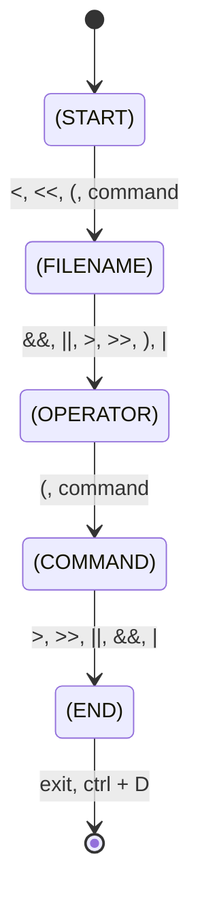

# minishell

## Table of contents

- [minishell](#minishell)
	- [Table of contents](#table-of-contents)
	- [TODO](#todo)
	- [Analyzing a subject](#analyzing-a-subject)
	- [Mandatory](#mandatory)
	- [Bonus part](#bonus-part)
	- [Allow functions](#allow-functions)
		- [readline](#readline)
		- [rl\_clear\_history](#rl_clear_history)
		- [rl\_on\_new\_line](#rl_on_new_line)
		- [rl\_replace\_line](#rl_replace_line)
		- [rl\_redisplay](#rl_redisplay)
		- [add\_history](#add_history)
		- [printf](#printf)
		- [malloc](#malloc)
		- [free](#free)
		- [write](#write)
		- [access](#access)
		- [open](#open)
		- [read](#read)
		- [close](#close)
		- [fork](#fork)
		- [wait](#wait)
		- [waitpid](#waitpid)
		- [wait3](#wait3)
		- [wait4](#wait4)
		- [signal](#signal)
		- [sigaction](#sigaction)
		- [sigemptyset](#sigemptyset)
		- [sigaddset](#sigaddset)
		- [kill](#kill)
		- [exit](#exit)
		- [getcwd](#getcwd)
		- [chdir](#chdir)
		- [stat](#stat)
		- [lstat](#lstat)
		- [fstat](#fstat)
		- [unlink](#unlink)
		- [execve](#execve)
		- [dup](#dup)
		- [dup2](#dup2)
		- [pipe](#pipe)
		- [opendir](#opendir)
		- [readdir](#readdir)
		- [closedir](#closedir)
		- [strerror](#strerror)
		- [perror](#perror)
		- [isatty](#isatty)
		- [ttyname](#ttyname)
		- [ttyslot](#ttyslot)
		- [ioctl](#ioctl)
		- [getenv](#getenv)
		- [tcsetattr](#tcsetattr)
		- [tcgetattr](#tcgetattr)
		- [tgetent](#tgetent)
		- [tgetflag](#tgetflag)
		- [tgetnum](#tgetnum)
		- [tgetstr](#tgetstr)
		- [tgoto](#tgoto)
		- [tputs](#tputs)

## TODO

- [x] parsing
	- [x] Assign Type
	- [x] quote check error code
	- [x] syntax check
- [x] execute
	- [x] 다중 파이프
	- [x] redirection 처리
	- [x] HERE_DOC
	- [x] 환경 변수 변환
	- [x] quote trim 처리
	- [x] leak 잡기 ("$USER"""''""$?) => $? ft_itoa free 안해줘서 생김
	- [x] builtin pipe 처리
	- [ ] norm 처리
- [x] process 상태값
- [x] signal 처리
	- [x] ctrl + D
	- [x] ctrl + C
		- [x] HERE_DOC
	- [x] ctrl + \
		- [x] HERE_DOC
		- [x] child process
- [x] 환경변수 치환
	- [x] 환경 변수를 어느정도 삭제 후에 ./minishell 을 하면 메모리 문제 발생
- [ ] 고칠 것들
	- 자식 프로세스의 leak 잡기 (path 안쓸 때 free 안해줌)
	- << a << b << c << d > file
		- sig_int로 취소할 때 file이 만들어지는 문제
		- exit status가 1이 아닌 11이 나오는 문제
	- '/' 가 들어올 때 path랑 합쳐지는 문제

## Analyzing a subject

- [*]: Start state, 프로세스가 시작될 때 오토마타가 어느 상태에서 시작하는지를 나타내는 특별한 상태
- (START): 파서의 초기 상태, 파서가 파싱 작업을 시작할 때 처음에 이 상태에 있음
- (FILENAME): 파일을 나타내는 상태, 파서가 파일 이름 부분을 파싱할 때 이 상태에 도달하며 파일 이름은 입력 리다이렉션 연산자(<, <<) 다음에 나오는 문자열 말함
- (OPERATOR): 논리 연산자(&&, ||)를 나타내는 상태, 논리 연산자를 파싱할 때 이 상태에 도달하며 논리 연산자는 명령어와 명령어 사이에 나타날 수 있음
- (COMMAND): 명령어를 나타내는 상태, 파서가 명령어 부분을 파싱할 때 이 상태에 도달하며 명령어는 출력 리다이렉션 연산자(>, >>) 또는 논리 연산자(&&, ||) 또는 파이프(|)로 끝날 수 있음
- (END): 파서의 종료 상태, 파서가 명령어를 성공적으로 파싱하고 유효성 검사를 마치면 이 상태로 전환되며 이 상태는 파싱 작업이 끝났음을 나타냄

- [developing-linux-based-shell](https://www.geeksforgeeks.org/developing-linux-based-shell/)
- [bash-parser](https://vorpaljs.github.io/bash-parser-playground/)

## Mandatory

- 당신의 쉘은:
	- 새로운 명령어를 입력할 수 있는 `프롬프트`를 보여줘야 합니다 => readline
	- 작업 `히스토리`를 갖고 있어야 합니다. => add_history
	- (PATH 변수나 상대, 절대 경로를 활용하여) 올바른 실행 파일을 찾아 실행할 수 있어야 합니다. => parse, exceve
	- `전역변수`는 한 개 초과를 사용할 수 없으며, 왜 전역변수를 사용했는지 깊게 생각해 보고 그 이유를 설명할 수 있어야 합니다. => shell 종료 시?
	- 닫히지 않은 따옴표나 특정되지 않은 특수문자 (\\나 ; 등...) 을 해석하지 않아야 합니다.
	- ' (단일 따옴표) 안에 있는 메타문자를 해석하지 않아야 합니다.
	- " (이중 따옴표) 안에 있는 $ (달러 기호)를 제외한 메타문자를 해석하지 않아야 합니다.
- 다음의 리다이렉션을 구현해야 합니다:
	- `<`는 입력을 리다이렉션 하여야 합니다
	- `>`는 출력을 리다이렉션 하여야 합니다
	- `<<`에 구분 기호를 지정한 다음, 현재 소스에서 구분자를 포함한 줄을 만나기 전까지 입력값을 읽어들입니다. 기록을 업데이트할 필요는 없습니다! => open(RDONLY)
	- `>>`는 출력을 추가 모드로 리다이렉션합니다. => open(APPEND)
- `파이프`( `|` 문자)를 구현해야 합니다. 각 파이프라인마다 명령어의 출력값은 파이프로 연결되어 다음 명령어의 입력값으로 들어가야 합니다. => pipex
- `환경변수` (`$` 다음에 문자열이 오는 형식) 은 그들의 값으로 확장되어야 합니다.
- `$?`는 가장 최근에 실행한 포그라운드 파이프라인의 종료 상태를 확장하여야 합니다
- `ctrl-C`, `ctrl-D` 그리고 `ctrl-\` 는 bash와 동일하게 동작하여야 합니다.
- 상호작용이 가능할 때:
	- `ctrl-C`는 새로운 줄에 새로운 프롬프트를 출력합니다
	- `ctrl-D`는 쉘을 종료합니다.
	- `ctrl-\`은 아무런 동작도 하지 않습니다.
- 다음의 `내장 기능들`을 실행할 수 있어야 합니다:
	- `-n` 옵션을 사용할 수 있는 `echo`
	- 오직 상대 또는 절대경로만 사용하는 `cd` => chdir
	- 옵션이 없는 `pwd`
	- 옵션이 없는 `export`
	- 옵션이 없는 `unset`
	- 옵션이나 인자값이 없는 `env`
	- 옵션이 없는 `exit`
- `readline()` 함수는 메모리 누수를 일으킬 수 있습니다. 이를 고칠 필요는 없습니다. 하지만 `당신이 직접 작성한 코드는 메모리 누수를 일으킬 수 있다는 것을 의미합니다.`

> 💡 여러분은 과제의 설명에만 국한되도록 설계해야 합니다. 요구하지 않은 것들을 만드실 필요는 없습니다. 의문점이 생긴다면 [bash](https://www.gnu.org/savannah-checkouts/gnu/bash/manual/)를 참고하세요.

## Bonus part

 

- 여러분의 프로그램은 다음을 구현해야 합니다:
	- 괄호를 이용해 우선순위를 표현한 `&&, ||`
	- 와일드카드 `*`가 현재 작업 디렉토리에 대해 동작하여야 합니다.

> 보너스는 필수로 구현해야 하는 파트가 완벽할 때만 평가될 것입니다. '완벽함' 이란, 모든 필수 파트가 전부 구현되어 있어야 하며 오작동하는 부분이 없어야 함을 의미합니다. 필수로 구현해야 하는 파트에서 만점을 받지 못한다면, 보너스 항목은 채점되지 않습니다.

## Allow functions

### readline

- [gnu](https://tiswww.case.edu/php/chet/readline/readline.html)
- [ref](https://wtg-study.tistory.com/103)
- [ref](https://junselee.tistory.com/3)
### rl_clear_history

> 히스토리 라이브러리의 clear_history() 함수와 동일한 방식으로 모든 항목을 삭제하여 히스토리 목록을 지웁니다. 이 함수는 clear_history와 다른 점은 Readline이 히스토리 목록에 저장하는 비공개 데이터를 해제한다는 점입니다.
### rl_on_new_line

> 일반적으로 줄 바꿈을 출력한 후 업데이트 함수에 새 (빈) 줄로 이동했음을 알립니다.
### rl_replace_line

> rl_line_buffer의 내용을 텍스트로 바꿉니다. 가능하면 포인트와 마크는 유지됩니다. clear_undo가 0이 아닌 경우 현재 줄과 연결된 실행 취소 목록이 지워집니다.
### rl_redisplay

> 0이 아닌 경우 이 포인터를 통해 간접적으로 Readline을 호출하여 편집 버퍼의 현재 콘텐츠로 디스플레이를 업데이트합니다. 기본적으로 이 값은 기본 Readline 재표시 함수인 rl_redisplay로 설정되어 있습니다(재표시 참조).

### add_history
### printf
### malloc
### free
### write
### access
### open
### read
### close
### fork
### wait
### waitpid
### wait3
### wait4
### signal
### sigaction
### sigemptyset
### sigaddset
### kill
### exit
### getcwd
### chdir
### stat
### lstat
### fstat
### unlink
### execve
### dup
### dup2
### pipe
### opendir
### readdir
### closedir
### strerror
### perror
### isatty
### ttyname
### ttyslot
### ioctl
### getenv
### tcsetattr
### tcgetattr
### tgetent
### tgetflag
### tgetnum
### tgetstr
### tgoto
### tputs
